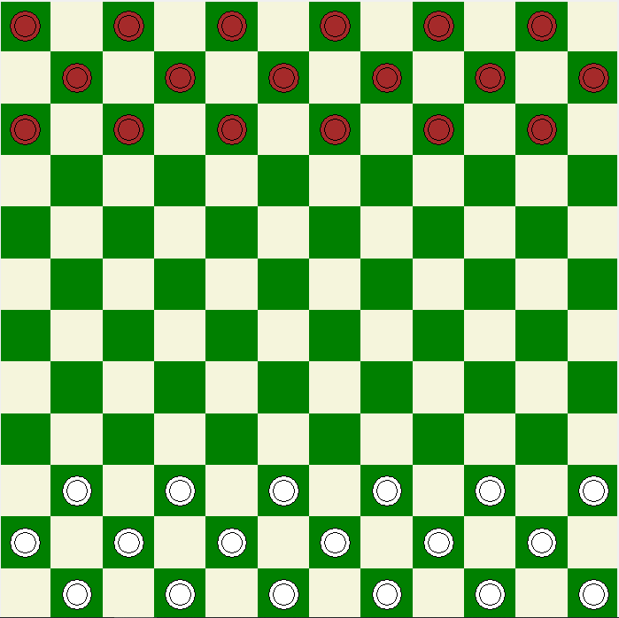

# Checkers-Tkinter

This repository is a simple use example of Tkinter (GUI Python Library).

With the Python script it's possible to draw customizable checkers/draughts boards. Opening the file, you will see a simple section of Constants which allow you to configure easily some properties of the board, like size and colors.

Below there's a few board examples you can try:

  
  
  

## Tkinter Elements Used
- Non-resizable frame
- Canvas: rectangle and oval
